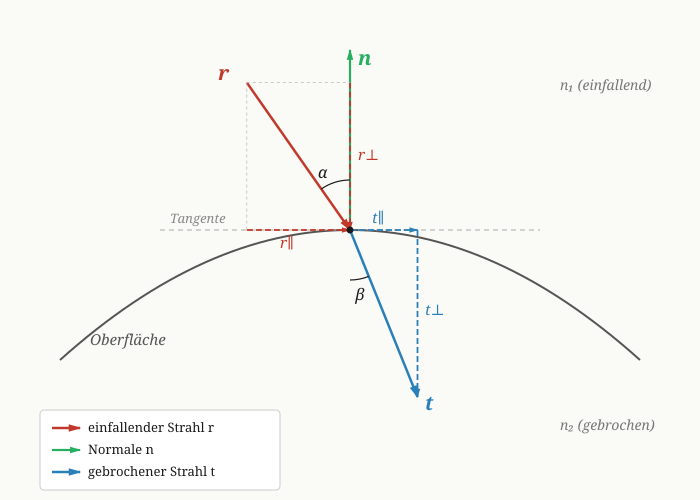

# Herleitung des gebrochenen Strahls (Snellius-Brechung in Vektorform)

## Ausgangssituation

Ein einfallender Strahl $\vec r$ trifft auf eine Oberfläche mit Normalenvektor $\vec n$. Beide Vektoren sind normiert:

$$
\|\vec r\| = \|\vec n\| = 1
$$

Konvention: $\vec r$ zeigt **in Richtung** der Oberfläche (auf den Auftreffpunkt zu), $\vec n$ zeigt vom Auftreffpunkt **weg** in den Halbraum, aus dem $\vec r$ kommt.

Das Verhältnis der Brechungsindizes ist

$$
\eta = \frac{n_1}{n_2}.
$$

Gesucht ist der gebrochene Strahl $\vec t$ mit $\|\vec t\| = 1$.

---

## 1. Zerlegung des einfallenden Strahls

Wir zerlegen $\vec r$ in eine zur Normalen parallele und eine zur Tangente parallele Komponente:

$$
\vec r = \vec r_\perp + \vec r_\parallel
$$

### Parallele Komponente zur Normalen ($\vec r_\perp$)

Die Projektion von $\vec r$ auf $\vec n$ ist

$$
\vec r_\perp = (\vec r \cdot \vec n)\,\vec n.
$$

### Einfallswinkel $\alpha$

Der Winkel zwischen dem **rückwärtigen** Strahl $-\vec r$ und der Normalen $\vec n$ ist der Einfallswinkel $\alpha = i$:

$$
\cos\alpha \;=\; (-\vec r) \cdot \vec n \;=\; -\vec r \cdot \vec n \;=\; cosi.
$$

### Tangentiale Komponente ($\vec r_\parallel$)

$$
\vec r_\parallel = \vec r - \vec r_\perp = \vec r - (\vec r \cdot \vec n)\,\vec n.
$$

Aus $\|\vec r\|=1$ folgt für den Betrag der Tangentialkomponente:

$$
\|\vec r_\parallel\| = \sin\alpha.
$$

---

## 2. Brechungsgesetz von Snellius

Das Snelliussche Brechungsgesetz lautet

$$
n_1 \sin\alpha = n_2 \sin\beta
\quad\Longleftrightarrow\quad
\eta\,\sin\alpha = \sin\beta.
$$

Für die Beträge der Tangentialkomponenten gilt also:

$$
\|\vec t_\parallel\| = \sin\beta = \eta \sin\alpha = \eta \|\vec r_\parallel\|.
$$

Da $\vec t_\parallel$ in dieselbe Richtung zeigt wie $\vec r_\parallel$, folgt daraus direkt:

$$
\vec t_\parallel = \eta \vec r_\parallel.
$$

Eingesetzt für $\vec r_\parallel$:

$$
\vec t_\parallel = \eta \,\vec r_\parallel = \eta\,\vec r - \eta\,(\vec r \cdot \vec n)\,\vec n.
$$

Mit $cosi = -\vec r \cdot \vec n$ wird daraus

$$
\boxed{\; \vec t_\parallel = \eta\,\vec r + \eta cosi\,\vec n \;}
$$

---

## 3. Normalenkomponente von $\vec t$

Da $\|\vec t\| = 1$ gelten soll, ergibt sich der Betrag der Normalenkomponente aus

$$
\cos\beta = \sqrt{1 - \sin^2\beta} = \sqrt{1 - \eta^2 \sin^2\alpha}.
$$

Wegen $\sin^2\alpha = 1 - \cos^2\alpha = 1 - cosi^2$ können wir das auch schreiben als

$$
\cos\beta = \sqrt{1 - \eta^2\bigl(1 - cosi^2\bigr)} \;=:\; k.
$$

Die Normalenkomponente von $\vec t$ zeigt **in** die Oberfläche hinein, also entgegen $\vec n$:

$$
\boxed{\; \vec t_\perp = -k\,\vec n \;}
$$

---

## 4. Zusammensetzen des gebrochenen Strahls

$$
\vec t \;=\; \vec t_\parallel + \vec t_\perp
\;=\; \eta\,\vec r + \eta cosi\,\vec n - k\,\vec n
$$

$$
\boxed{\; \vec t \;=\; \eta\,\vec r + \bigl(\eta cosi - k\bigr)\,\vec n \;}
$$

mit

$$
cosi = -\vec r \cdot \vec n,
\qquad
k = \sqrt{1 - \eta^2\bigl(1 - cosi^2\bigr)}.
$$

---

## Bemerkung: Totalreflexion

Falls der Radikand negativ wird,

$$
1 - \eta^2\bigl(1 - cosi^2\bigr) < 0,
$$

existiert kein gebrochener Strahl — es liegt **Totalreflexion** vor. Dies kann nur auftreten, wenn $\eta > 1$, also beim Übergang vom optisch dichteren ins optisch dünnere Medium.
